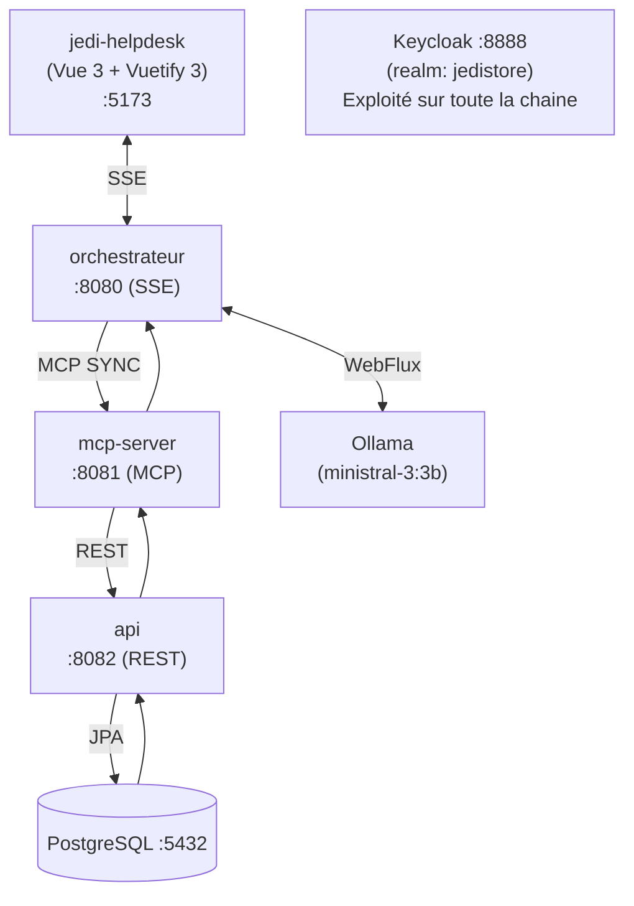
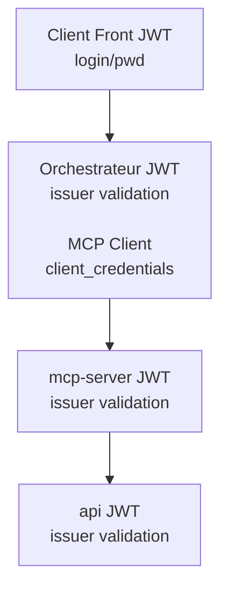

# Jedi Store

Application de gestion d'un magasin Star Wars avec architecture microservice, IA conversationnelle et protocole MCP.

## Stack technique

| Technologie | Version |
|-------------|---------|
| Java | 25 |
| Spring Boot | 4.0.2 |
| Spring AI | 2.0.0-M2 |
| PostgreSQL | 16 |
| Keycloak | 26.5.2 |
| Ollama | local (`ministral-3:3b`) |
| Vue 3 + Vuetify 3 | 3.4 / 3.5 |

---

## Architecture



### Modules Maven (7)

| Module | Rôle | Livrable | Port |
|--------|------|----------|------|
| `core` | Domaine : entités, ports, use cases, services | - | - |
| `bdd-connector` | Adapters JPA + migrations Flyway | - | - |
| `api-spec` | Spécifications OpenAPI (YAML) | - | - |
| `shared-utils` | Enum `AuthAccessLevel` partagé | - | - |
| `api` | Adapter REST généré depuis OpenAPI | JAR | 8082 |
| `mcp-server` | Serveur MCP avec outils AI | JAR | 8081 |
| `orchestrateur` | Chat IA (ChatClient + mémoire + SSE) | JAR | 8080 |

---

## Prérequis

- **Docker & Docker Compose**
- **NVIDIA Container Toolkit** (optionnel) — pour l'accélération GPU du service Ollama
- **Maven 3.9+** et **Java 25** (pour le développement local uniquement)

---

## Démarrage rapide

### 1. Lancer les services

```bash
docker-compose up -d
```
Cela démarre :
- PostgreSQL (`:5432`)
- Keycloak (`:8888`) — realm `jedistore` à configurer (fichier de configuration sous keycloak/realm-jedistore.json)
- API REST (`:8082`) — avec les migrations Flyway automatiques
- MCP Server (`:8081`)
- Orchestrateur (`:8080`)
- Jedi Helpdesk (`:5173`)

ou simplement des application 'infra' : ollama, keycloak, postgres

```bash
./start-infra.sh
```
Cela permet de lancer depuis son IDE les services api, mcp-server, orchestrateur et jedi-helpdesk pour debug.

### 2. Vérifier que les services sont up

```bash   # Liste des produits
curl http://localhost:8080/actuator/health  # Santé de l'orchestrateur
```

### 3. Démarrage local (sans Docker)

```bash
# Build complet
mvn clean package -DskipTests

# Lancer chaque service (PostgreSQL et Keycloak doivent tourner)
java -jar api/target/api-1.0.0-SNAPSHOT.jar
java -jar mcp-server/target/mcp-server-1.0.0-SNAPSHOT.jar
java -jar orchestrateur/target/orchestrateur-1.0.0-SNAPSHOT.jar
```

La configuration défini dans le dépôt apporte un real, 2 clients et des roles. Cependant plusieurs points restent à configurer:
 - créer un utilisateur 'luke', lui définir un mot de passe et lui attribuer le role USER
 - créer un utilisateur 'yoda', lui définir un mot de passe et lui attribuer le role ADMIN
 - Récupéré le secret du client id mcp-auth et le renseigner dans le fichier src/main/resources/application.yml sous spring.security.oauth2.client.registration.mcp-server.client-secret

Par default deux utilisateurs sont créé avec l'instance docker keycloack:

 | login | password | role |
 |-------|----------|------|
 | luke | luke | USER |
 | yoda | yoda | ADMIN |

---

## API REST (`:8082`)

| Méthode | Endpoint | Description |
|---------|----------|-------------|
| `GET` | `/customers/{id}/orders` | Commandes d'un client |
| `GET` | `/customers?name=&email=` | Recherche de clients |
| `GET` | `/products` | Liste tous les produits |
| `GET` | `/orders/{id}` | Détail d'une commande |
| `PUT` | `/orders/{id}/status` | Mettre à jour le statut |

### Exemples

```bash
# Produits
curl http://localhost:8082/products

# Commandes d'un client
curl http://localhost:8082/customers/1/orders

# Créer une commande
curl -X POST http://localhost:8082/orders \
  -H "Content-Type: application/json" \
  -d '{"customerId": 1, "lines": [{"productId": 5, "quantity": 2}]}'

# Mettre à jour le statut
curl -X PUT http://localhost:8082/orders/1/status \
  -H "Content-Type: application/json" \
  -d '{"status": "DELIVERED"}'
```

Statuts possibles : `IN_PROGRESS`, `DELIVERED`, `CANCELLED`

---

## Interface graphique — jedi-helpdesk (`:5173`)

Application Vue 3 + Vuetify 3 permettant d'interagir avec l'orchestrateur via SSE en temps réel.

Fonctionnalités : chat temps réel, reconnexion automatique avec backoff exponentiel, thème clair/sombre, affichage horodaté des messages.

> Voir [jedi-helpdesk/README.md](jedi-helpdesk/README.md) pour l'installation et la configuration.

---

## Chat IA (`:8080`)

L'orchestrateur expose une API de conversation en streaming (Server-Sent Events).
Il utilise Ollama (`ministral-3:3b`) et maintient une mémoire de conversation par session.

### Endpoints

| Méthode | Endpoint | Description |
|---------|----------|-------------|
| `POST` | `/chat` | Envoyer un message (SSE streaming) |
| `DELETE` | `/chat/session/{sessionId}` | Effacer l'historique de session |

### Exemple

```bash
curl -X POST http://localhost:8080/chat \
  -H "Content-Type: application/json" \
  -d '{"sessionId": "session-1", "message": "Quelles sont les commandes du client 1 ?"}'
```

La réponse est streamée en SSE. Le LLM appelle automatiquement les outils MCP selon le besoin.

---

## Outils MCP (`:8081`)

Le MCP Server expose 6 outils utilisés par l'orchestrateur. L'accès est filtré par rôle Keycloak.

| Outil | Rôle requis | Description |
|-------|-------------|-------------|
| `USER_getCustomerOrders` | USER | Commandes d'un client par son ID |
| `USER_getOrderDetails` | USER | Détail complet d'une commande |
| `USER_searchProducts` | USER | Recherche de produits par nom/catégorie |
| `USER_searchCustomer` | USER | Recherche de clients par nom ou email |
| `ADMIN_updateOrderStatus` | ADMIN | Modifier le statut d'une commande |

La convention de nommage `ROLE_nomOutil` permet au filtrage automatique dans l'orchestrateur.

---

## Sécurité

### Keycloak

- URL admin : `http://localhost:8888`
- Credentials admin : `admin` / `admin`
- Realm : `coruscant`

### Niveaux d'accès

```
READ_ONLY < USER < ADMIN < SUPER_ADMIN
```

Les outils MCP sont préfixés par leur niveau (`USER_`, `ADMIN_`). L'orchestrateur filtre les outils disponibles selon le rôle JWT du token Keycloak (`realm_access.roles`).

Un utilisateur sans token JWT (anonyme) a accès au niveau `READ_ONLY` uniquement.

### Propagation JWT



Le MCP Client utilise un client OAuth2 `mcp-auth` (client_credentials) pour appeler le MCP Server et ce dernier réexploite le même token pour appeler l'API.

---

## Base de données

### Schéma

| Table | Colonnes principales |
|-------|---------------------|
| `customers` | `id`, `name`, `email` (unique), `address` |
| `products` | `id`, `name`, `description`, `price`, `category` |
| `orders` | `id`, `order_date`, `customer_id`, `status`, `total_amount` |
| `order_lines` | `id`, `order_id`, `product_id`, `quantity`, `unit_price` |

### Données initiales (Flyway)

- `V1__create_tables.sql` — création du schéma
- `V2__insert_data.sql` — 10 clients Star Wars, 30 produits, 50 commandes

Credentials PostgreSQL : `jedistore` / `jedistore` / `jedistore` (user/password/db)

---

## Configuration clé

### Variables d'environnement Docker

| Variable | Service | Valeur par défaut                           |
|----------|--------|---------------------------------------------|
| `SPRING_DATASOURCE_URL` | api | `jdbc:postgresql://postgres:5432/jedistore` |
| `SPRING_DATASOURCE_USERNAME` | api | `jedistore`                                 |
| `SPRING_DATASOURCE_PASSWORD` | api| `jedistore`                                 |
| `SPRING_AI_OLLAMA_BASE_URL` | orchestrateur, mcp-server | `http://llm:11434`                          |
| `MCP_SERVER_URL` | orchestrateur | `http://mcp-server:8081`                    |
 | `SPRING_PROFILES_ACTIVE` | orchestrateur, api, mcp-server | ` docker`                                   |

---

## Tests

```bash
# Tests unitaires du domaine (core)
mvn test -pl core

# Build complet sans tests
mvn clean package -DskipTests
```

Les tests unitaires couvrent les use cases dans le module `core` (JUnit 5 + Mockito).

---

## Architecture hexagonale (core)

```
core/
├── domain/
│   ├── entity/       Customer, Product, Order, OrderLine
│   ├── valueobject/  OrderStatus (IN_PROGRESS, DELIVERED, CANCELLED)
│   ├── exception/    CustomerNotFoundException, OrderNotFoundException, ProductNotFoundException
│   └── command/      UserSearchQuery
├── port/
│   ├── in/           CustomerUseCase, ProductUseCase, OrderUseCase
│   └── out/          CustomerRepositoryPort, ProductRepositoryPort, OrderRepositoryPort
└── service/          CustomerService, ProductService, OrderService
```

Le domaine n'a aucune dépendance externe (ni Spring, ni JPA).
